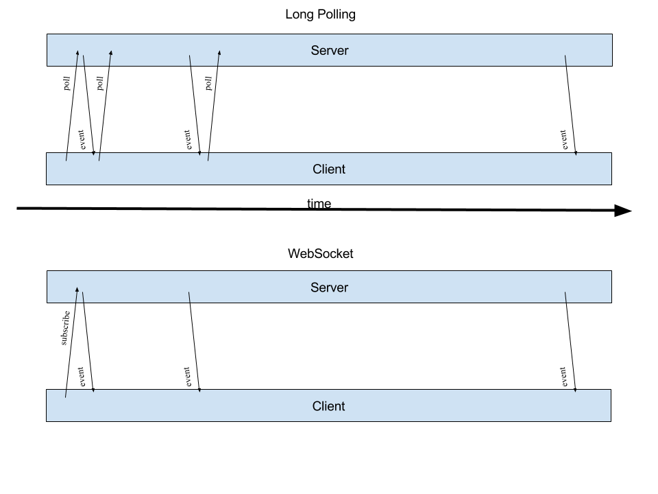

# WebSocket

Das WebSocket-Protokoll wurde entwickelt, um bidirektionale Verbindungen zwischen einer Client-Anwendung und einer Host-Anwendung in einer möglichst effizienten Art und Weise zu ermöglichen.  
  
Vor der Entwicklung dieses Protokolls musste das sog. _polling_ (über HTTP) verwendet werden.  
Polling kommt aus dem Englischen und bedeutet übersetzt: befragen oder abfragen. Das heißt, die Client-Anwendung befragt immer wieder die Host-Anwendung nach Neuigkeiten und die Host-Anwendung gibt eine Antwort bzw. eine leere Antwort zurück. Mit dem sog. _long polling_ gibt es eine etwas effizientere Möglichkeit des einfachen pollings.  
Wieder startet die Client-Anwendung eine Anfrage. Die Host-Anwendung antwortet aber nur, wenn es auch eine Neuigkeit gibt. Ansonsten wird die HTTP-Verbindung so lange offen gehalten, bis eine Neuigkeit entsteht. Erst dann sendet die Host-Anwendung über die bereits etablierte HTTP-Verbindung die Nachricht an die Client-Anwendung und die Verbindung ist damit beendet. Die Client-Anwendung wird dann wieder eine neue HTTP-Verbindung zur Host-Anwendung öffnen und damit auf Neuigkeiten warten.  
Die Nutzung des pollings bzw. long pollings erlaubt zwar eine Art der bidirektionalen Kommunikation, es ergeben sich jedoch einige Nachteile. In dem RFC 6455 Dokument der IETF zur Standardisierung des WebSocket-Protokolls werden die folgenden Punkte genannt:  
* Die Host-Anwendung muss für jede Client-Anwendung mehrere TCP-Verbindungen aufrechterhalten. Dabei entfällt immer mindestens eine Verbindung auf die polling-Verbindung zur Client-Anwendung und für jede weitere Nachricht durch die Client-Anwendung entsteht eine neue Verbindung.
* Es besteht allgemein ein hoher Anteil an ungenutzten Daten beim Informationsaustausch (Overhead durch HTTP-Header), da die Header-Informationen immer hin und her gesendet werden. Insbesondere in einem Szenario, wie einer Chat-Anwendung, kann die Größe des Headers die Größe der zu transportierenden Nachricht übersteigen.
* Die Client-Anwendung muss die ausgehenden Verbindungen mappen, um die Antworten der Host-Anwendung richtig interpretieren zu können.  
  
  
Das WebSocket-Protokoll kann diese Nachteile durch die Nutzung einer einzigen TCP-Verbindung umgehen und bricht dennoch nicht mit der HTTP-Infrastruktur, sodass auch die WebSocket-Kommunikation über die Ports 80 und 443 oder aber über HTTP-Proxy Verbindungen erfolgen kann.  
Nach einem sog. _handshake_ der Teilnehmer (Client- und Host-Anwendung) kann der bidirektionale Nachrichtenaustausch beginnen.

Abbildung A: Veranschaulichung Long Polling und WebSocket Kommunikation

