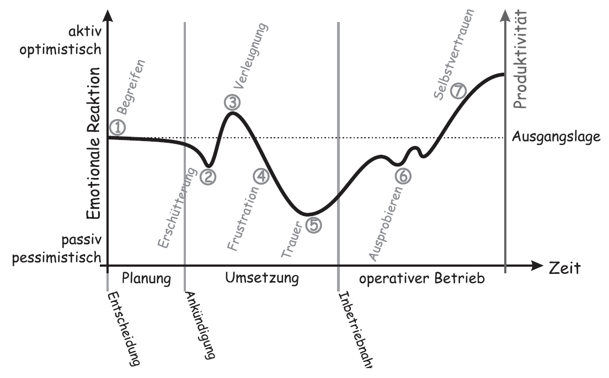
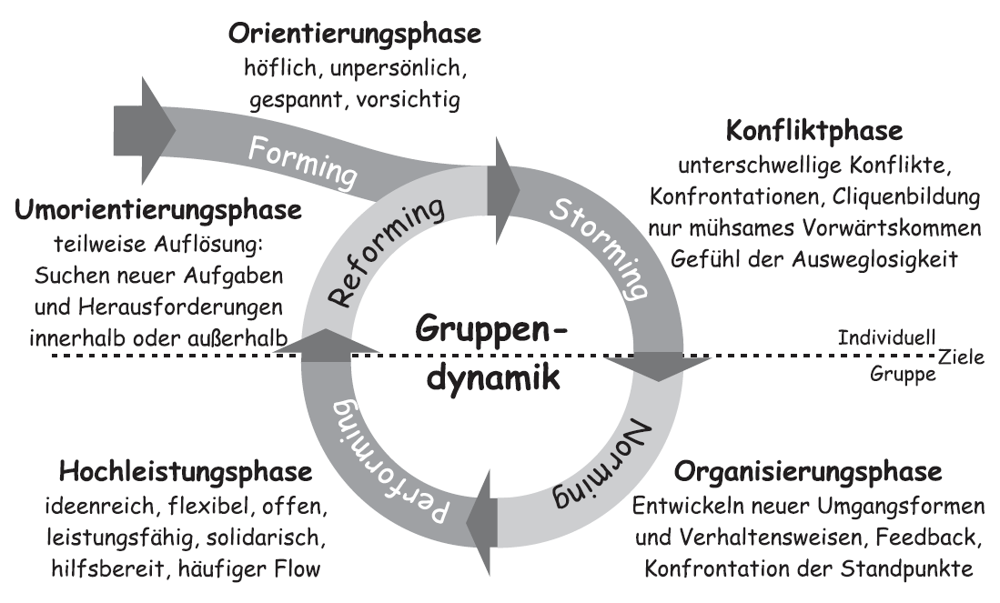
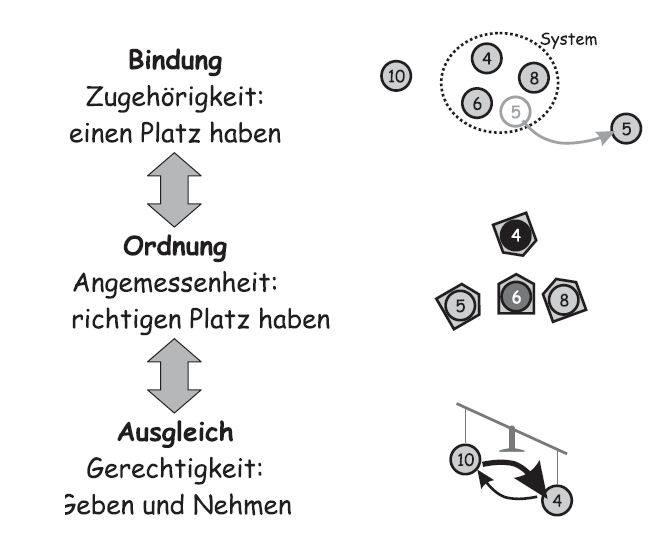

## 10.1 Warum fallen uns Veränderungen so schwer?

Ein Veränderungsmanagement wird definiert als die kontinuierliche Begleitung von grundsätzlichen Veränderungen. Die notwendigen Maßnahmen im Laufe des Prozesses werden als Projekte durchgeführt. 

Jedes IT-Projekt benötigt ein Veränderungsmanagement, da durch neue Geschäftsprozess-Software die Arbeitsweisen der Mitarbeiter oder durch neue Produktionssteuerungen die Produktionsabläufe sich ändern.  Beratungsprojekte werden daher fast auch immer von einem Veränderungsmanagement begleitet.

IT-Beratungen sind aufwendig und teuer. Sie lohnen sich aus Kundensicht nur, wenn Themen aus eigener Kraft nicht angegangen werden können oder auf Grund von Rahmenbedinungen nicht in der gewünschten Zeit umsetzbar sind.

## 10.1.1 Der einzelne Mitarbeiter

Obwohl Weiterentwicklungen unseren ganz normalen Alltag bestimmen, fehlt es oft an einem langfristig erfolgreichen Veränderungsmanagment. Die Folge ist, dass Mitarbeiter teilweise überfordert und frustiert sind, da ihre Erwartungen an die erhofften Verbesserungen nicht erfüllt werden. Die betroffenen Mitarbeiter erleben ein Wechselbad der Gefühle. Dieser Gefühlsverlauf von Mitarbeitern wurde in Form einer Kurve von der Boston Consulting Group veröffentlicht.

**(1) Begreifen** -  Der Mitarbeiter sieht die eigenen Erwartungen bei einer Veränderung als nicht erfüllbar an.

**(2) Erschütterung** - Der Mitarbeiter ist erschüttert bzw. geschockt.

**(3) Verleugnung** - Der Mitarbeiter verneint die Veränderung, um sich selbst zu schützen.

**(4) Frustation -  (5) Trauer** - Es setzt ein Verstehensprozess ein und der Mitarbeiter akzeptiert die Lage. Er erkennt, dass er alte Verhaltensmuster aufgeben muss.

**(6) Ausprobieren** - Der tiefen Trauer entkommt der Mitarbeiter nur durch Ausprobieren neuer Verhaltensweisen. Durch das Aufbauen  von neuem Wissen über die Abläufe gewinnt der Mitarbeiter wieder an Sicherheit.

**(7) Selbstvertrauen** - Der Mitarbeiter gewinnt durch Erfolge wieder Selbstvertrauen.

Der Kurvenverlauf offenbart, dass die Produktivität über die Dauer der Veränderung schwankt und ein dauerhafter Mehrwert sich erst spät einstellt. Der Ablauf in der Veränderungskurve ist unumkehrbar. Die Mitarbeiter reagieren auf diese Unumkehrbarkeit sehr unterscheidlich.

### 10.1.2 Die Organisation und das Timing

Eine IT-Beratung wird meist auf Managementebene initiiert. Jedoch haben Veränderungsprozesse eine eigene Dynamik, da diese Prozesse Konsequenzen für Mitarbeiter, Linienführungskräfte und weitere Rollen haben. Die Veränderungskurven finden auf verschiedenen Organisationshierachienebenen phasenversetzt statt. Ein Veränderungsprozess auf einer Ebene kann einen Veränderungsprozess zu einem späteren Zeitpunkt auf einer anderen Ebene iniitieren, um eine Anpassung des betroffenen Aspekts umzusetzen. Die Phasenverschiebung kann zu Problemen der interen Kommunikation eines Unternehmens führen, wenn z.B. das Management die Veränderung abgeschlossen hat und die Mitarbeiter sich jedoch noch in der Trauerphase befinden. Die Kommunikation ist dann oft nicht empfängerorientiert und verfehlt somit sein Ziel.

### 10.1.3 Was kann Veränderungsmanagement leisten?

Ein gutes Veränderungsmanagement setzt Aktionen erfolgreich um. Bei einer Veränderung durchleben dabei die Mitarbeiter zwar genau die gleichen Phasen des Gefühlverlaufs, jedoch kann die Dauer der Phasen verkürzt und die emotionalen Reaktionen verringert werden.

### 10.1.4 Veränderungen unterstützen

Um als Berater den Veränderungsprozess zu unterstützen, muss er die aktuelle Phase einer Veränderung bestimmen können und sein Verhalten so anpassen, dass es die Menschen bei der Veränderung bestmöglich unterstützt. Zusätzlich besitzt er die Aufgabe den Informationsfluss zwischen Führungskraft und Mitarbeitern sicherzustellen. Die nachfolgende Abbildung zeigt die Veränderungskurve und den notwendigen Memen.

**Vom Begreifen zur Erschütterung** - Die Ordnung muss wie vor Beginn der Veränderung beibehalten werden. Die Führungskräfte müssen ihren Mitarbeitern aktiv zuhören und die Beweggründe für die Veränderung erläutern.

**Von der Erschütterung zur Verleugnung** - Die Mitarbeiter lehnen auf Grund von Angst die Veränderung ab. Die Führungskräfte müssen fest an der Veränderung festhalten und keinen Zweifel aufkommen lassen.

**Von der Verleugnung zur Frustation** - Die Mitarbeiter merken, dass sie ihr Verhalten ändern müssen. Die Führungskräfte müssen sie dabei so gut es geht unterstützen.

**Von der Frustation zur Trauer** - Führungskräfte können zugeben, dass sie keine detaillierte Lösung haben,  und können dies nutzen, um eine engere Kommunikation mit den Mitarbeitern aufzubauen und sie zum Durchhalten zu ermutigen.

**Von der Trauer zum Ausprobieren** - Die Mitarbeiter verstehen, welches Verhalten zieldienlich ist. Die Führungskräfte stehen den Mitarbeitern mehr beratend und reflektierend zur Seite. Spitzenleistungen werden honoriert und kommuniziert.

## 10.2 Veränderungsmanagementmodelle

**Analyse des Problems**

Bei anstehenden Veränderungen ist es zunächst essentiell wichtig konkrete Informationen zu sammeln und die Punkte zu klären, die zu beachten sind. Es ist immer wieder zu erkennen, dass zu vorschnell über Lösungen nachgedacht wird. Dies führt dazu das Lieblingslösungen einer Person (z.B. zu einer Organisationsstruktur oder bestimmte agile Techniken) gewählt werden, die sich am Ende als unpassend erweisen. Weiterhin folgt aus dieser Lösungsprägung, dass nur noch Informationen betrachtet werden, die zu dem Bild einzelner Personen passen und wichtige Informationen übersehen werden.  Ein weiteres Problem ist, dass die Fähigkeiten der betroffenen Personen oder der Einsatz von konkreten Lösungen als viel zu optimistisch angesehen werden. Es kommt folglich zu Verzögerungen bis hin zum Scheitern der Veränderung.

**Frühe Kommunikation**

Anstehende Veränderungen sollten bereits früh kommuniziert werden, damit sich durch die umfangreiche Kommunikation kein unvollständiges Bild ergibt. Ein vollständiges Bild ist wichtig, damit die Konzeption keine Lücken aufweist und alle wichtigen Stakeholder abgeholt werden. Durch den intensiven Austausch mit relevanten Stakeholdern können Konflikte rechtzeitig aufgedeckt und konstruktiv gelöst werden.

**Faule Kompromisse**

Faule Kompromisse können zu einem Scheitern des Veränderungsprozesses führen. Häufige Symptome sind, das Bestehen lassen von alten Abläufen oder Rollen oder das Hinausschieben von Entscheidungen, die jedoch jetzt benötigt werden.

**Ausprobieren**

Es wird häufig vergessen, dass Veränderungen viel mit Ausprobieren zu tun haben. Die Folge ist, dass der Druck entsteht, alle Entscheidungen zu einem frühen Zeitpunkt treffen zu müssen. Da jedoch im frühen Stadium die Unsicherheit sehr hoch ist, werden Entscheidungen lieber gar nicht getroffen.

## 10.3 Dynamik in Gruppen

Die Teamdynamik ist bei Veränderungen ein mächtiger Aspekt. Sie kann Veränderungsprozesse unterstützen, aber auch blockieren. Ein Verständnis über diese Dynamik ist daher für IT-Berater unbedingt notwendig.

### 10.3.1 Die Teamuhr

Die nachfolgende Abbildung zeigt die Phasen, die jedes Team zyklisch durchläuft.

**Forming**: Diese Orientierungsphase ist geprägt von Unsicherheit und distanzierten Verhalten. Die Teammitglieder versuchen sich aneinander zu gewöhnen und verhalten sich daher meist vorsichtig.

**Storming**: In dieser Konfliktphase kommt es vermehrt zu Machtkämpfen. Es bilden sich Cliquen und es entstehen Konflikte. Das Team kommt nur mühsam voran. 

**Norming**: In dieser Organisierungsphase entwickeln sich gruppeneigene Umgangsformen und Verhaltsweisen. Die Teammitglieder intensivieren ihre Zusammenarbeit. Jedes Mitglied hat seine eigenen Aufgaben und wird innerhalb des Teams akzeptiert.

**Performing**: Die Gruppe ist äußerst leistungsfähig. Die Teammitglieder sind offen, ideenreich, flexibel und offen für Neues.

**Reforming**: Einige Teammitglieder wagen den Aufbruch zu neuen Ufern. Dadurch haben einzelne Gruppenmitglieder die Chance nachzurücken. Die Gruppenstruktur ändert sich deutlich, sodass es zu Unruhe und unzufirdenheit kommt.

### 10.3.2 Systemische Betrachtungen und Grundregeln

Bei einer systemischen Organisationsberatung wird das Zusammenspiel mehrerer Elemente und im Kontext des Systems betrachtet, um eine Lösung für ein Problem zu finden. Die Lösung kommt dabei aus dem System, da die die betroffenen Personen die Experten des Problems sind.

In einem System gibt es drei Ebenen, um die eigene Position innerhalb einer Gruppe zu bewerten. Diese Ebenen stehen in Wechselwirkung, da z.B. ein Problem auf einer Ebene Wirkung auf andere Ebenen haben kann.

**Bindung**: Auf dieser Ebene geht es um die Frage, ob ich neben der formalen Zuordnung zu einer Gruppe oder eines Projektteams, mich auch tätsächlich als Mitglied fühle und von den Kollegen im Team akzeptiert werde.

**Ordnung**: Die nächste Frage nach der Klärung der Zugehörigkeit ist, ob ich mich selbst im Team am richtigen Platz sehe. Fühle ich mich in meiner Rolle im Team wohl?

**Ausgleich**: In dieser Ebene geht es um die richtige Balance zwischen Geben und Nehmen. Bin ich der einzige der Überstunden macht und bekomme ich etwas von den Kollegen zurück?

### 10.3.3 Systemische Ordnung in Gruppen

Als IT-Berater für ein bestehendes Team gilt es die systemische Ordnung in der Gruppe zu verstehen. Ein erster Ausgangspunkt ist dabei die Eintrittreihenfolge. Weitere Fragen, wie z.B. "Wer bildet den Kern?", "Wer wird akzeptiert und von anderen Gruppenmitgliedern zu Entschiedungen hinzugezogen?", geben ein detailiiertes Verständis über diese Ordnung.
